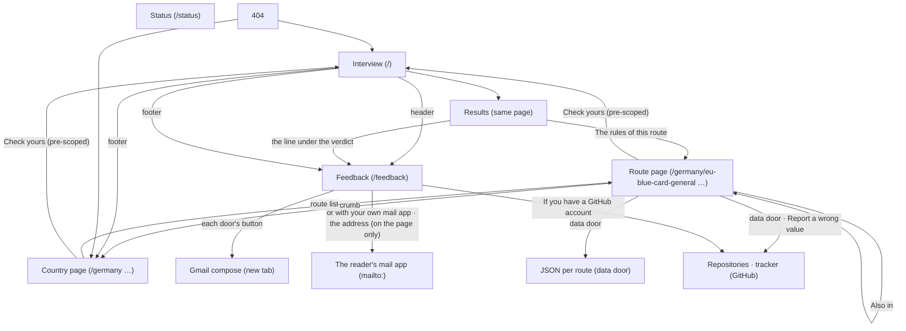
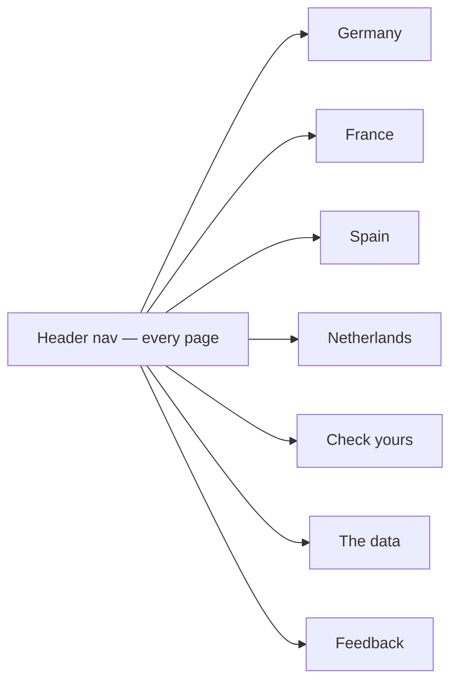

# Site map — Permit Rulebook (born 2026-09-08, at 29 pages)

Every screen a reader can reach and how they move between them. Born late:
the product reached 29 pages with screens approved one at a time and nobody
owning the space between them (the human's finding on the live site, and the
Orientation lens added to the critique rubric the same day). From here on,
every new screen is placed on this map before it is mocked, and its mock shows
its exits.

## The screens

## /feedback/ (placed 2026-09-16, built in s13)

The door for a reader who wants to say something without anything being wrong.
Reached from the header's word on every page, from the footer's Feedback
column, and from the line under the verdict on a results screen — three ways
in, so it is not an orphan and is never reachable from a footer only. Its own
exits: each door's button → Gmail's compose screen in a new tab (the human's
walk, 2026-09-16: on their desktop every `mailto:` opened nothing), under it
*or with your own mail app* → the same mail as a `mailto:` (a value is wrong ·
something is missing · anything else), the address in plain text beside them,
and, beneath a rule, the GitHub tracker's two links for a reader with an
account who wants the public record. Nothing else leaves it — it is not a
form and not a backend.

## The gaps this map shows (2026-09-08)

- **No shared navigation.** The identity mock drew a header nav ("Routes ·
  Check yours · The data"); the built site has none. Each screen navigates its
  own way: the interview by footer, the route page by crumb and "Also in",
  the country page by nothing.
- **Country → country: no move.** From `/germany/` there is no way to
  `/france/` except back to the home footer.
- **Status page: reachable from nowhere.**
- **Search: none**, and none planned at 23 routes; the four country lists are
  the index. Revisit when v1.1 raises the page count to ~37.

## The navigation to design (mock next, critiqued in isolation, then approved)

One header on every page, from the identity mock's register:

Amended 2026-09-16 (s13): the four countries sit under one word, *Countries*,
as a disclosure in the row — the word is the country's own name on a page that
belongs to one — and *Feedback* joins the row after *The data*. The row holds
four items, not seven.

- The four countries as a row; the current country marked on country and route
  pages.
- "Check yours" → the interview from the start; the page's own "Check yours —
  <country>" button is the pre-scoped one.
- "The data" → the on-site data page (today's /status, retitled): version,
  newest read date, downloads, the repository and the tracker — so the page
  that proves the liveness is one step from anywhere (critique B3, 2026-09-08).
- At 390 px the row folds behind one "Menu" control (the identity mock's
  phone header).
- Footer keeps the data page, the tracker and the licence.

No crumbs: the header (wordmark + marked country) and the h1 say where you
are (human, 2026-09-08). The nav is the same markup from one source
(`masthead()`), so it cannot differ between pages — the Orientation lens
reads that as a finding.

## The footer (mocked 2026-09-08, `s6-footer.html`)

One footer on every page, from the same source as the header: the disclaimer
sentence; three columns — Routes (the four countries, current marked, then
"Check yours"), The data (what it holds and
its gates · this route as JSON on route pages · the repository · the licence),
Feedback ("How to write, and what happens" → /feedback/ · sponsor — the
tracker's two links left this column for /feedback/ in s13, and the address
never settled here: it was a row for a day and the human took it out on the
walk, so the footer's only way to a mail is the page); then
the data line (dataset version · schema · newest value read · checked daily)
beside the small seal and the licences. It repeats the header's four countries
on purpose: at the bottom of a long page the header is a screen away.
