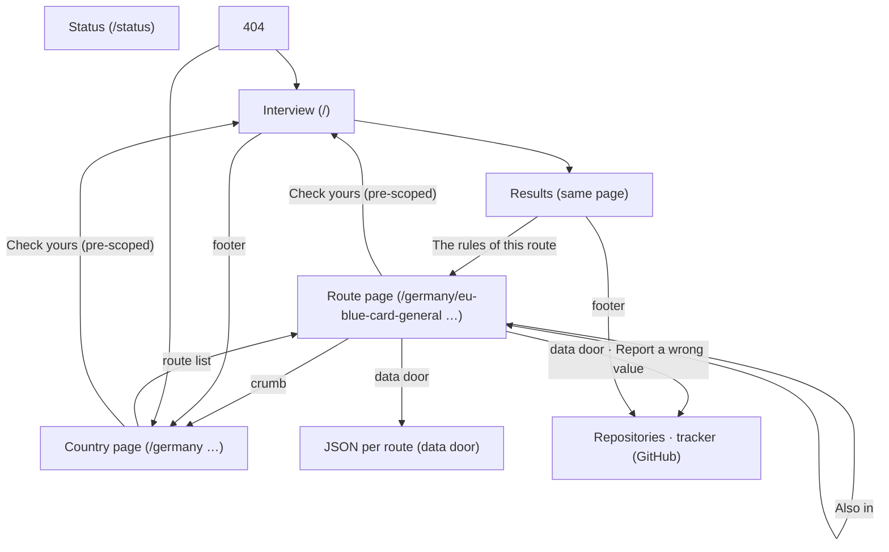
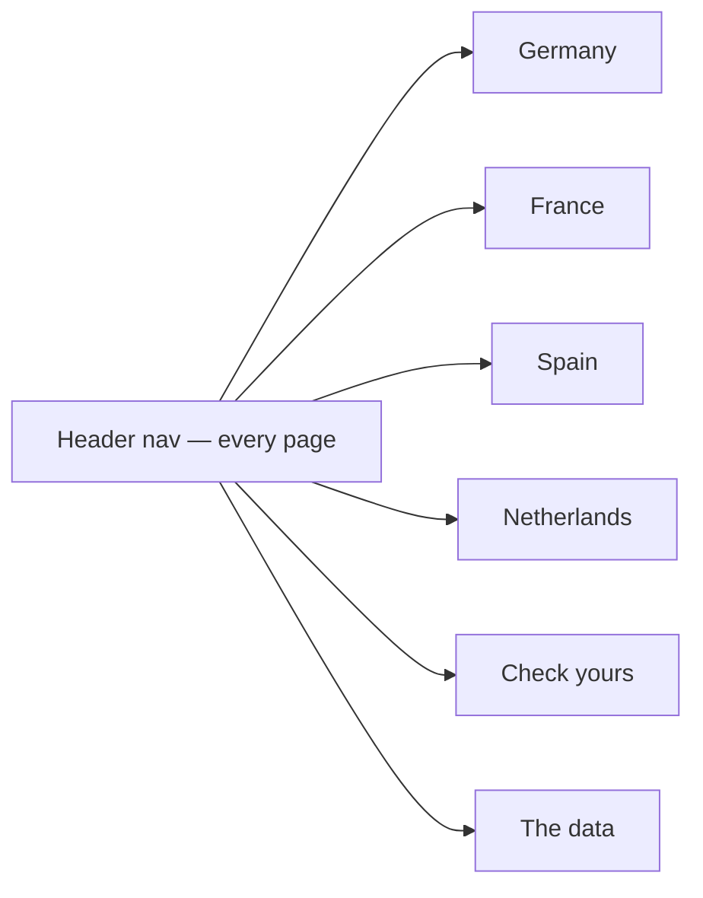

# Site map — Permit Rulebook (born 2026-09-08, at 29 pages)

Every screen a reader can reach and how they move between them. Born late:
the product reached 29 pages with screens approved one at a time and nobody
owning the space between them (the human's finding on the live site, and the
Orientation lens added to the critique rubric the same day). From here on,
every new screen is placed on this map before it is mocked, and its mock shows
its exits.

## The screens

## The gaps this map shows (2026-09-08)

- **No shared navigation.** The identity mock drew a header nav ("Routes ·
  Check yours · The data"); the built site has none. Each screen navigates its
  own way: the interview by footer, the route page by crumb and "Also in",
  the country page by nothing.
- **Country → country: no move.** From `/germany/` there is no way to
  `/france/` except back to the home footer.
- **Status page: reachable from nowhere.**
- **Search: none**, and none planned at 23 routes; the four country lists are
  the index. Revisit when v1.1 raises the page count to ~37.

## The navigation to design (mock next, critiqued in isolation, then approved)

One header on every page, from the identity mock's register:

- The four countries as a row; the current country marked on country and route
  pages.
- "Check yours" → the interview, pre-scoped to the current country or route
  where there is one.
- "The data" → the data repository (later: a data page).
- At 390 px the row folds behind one "Menu" control (the identity mock's
  phone header).
- Footer keeps the tracker, the licence and the status page link (the status
  page's first door).

No crumbs: the header (wordmark + marked country) and the h1 say where you
are (human, 2026-09-08). The nav is the same markup from one source
(`masthead()`), so it cannot differ between pages — the Orientation lens
reads that as a finding.
